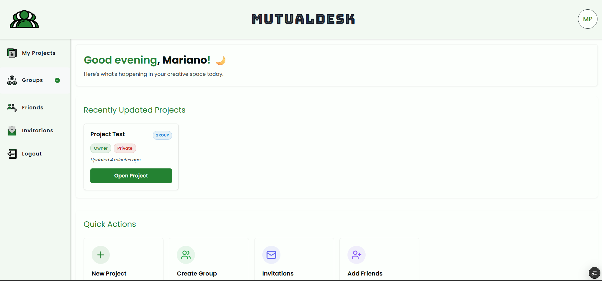
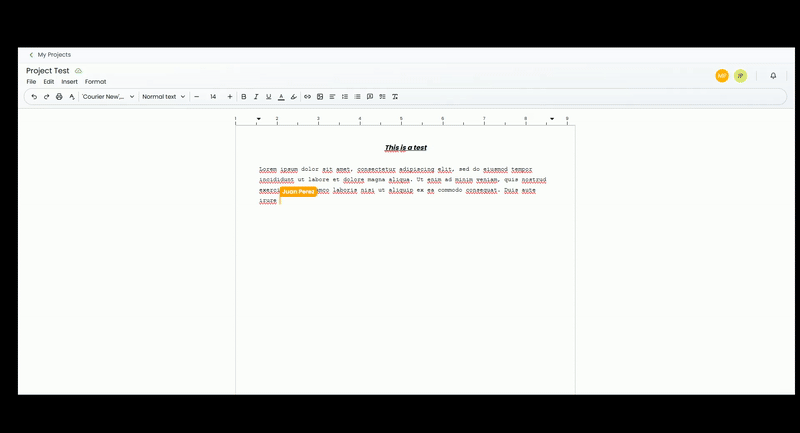

# MutualDesk

MutualDesk is a collaborative online text editor inspired by Google Docs.  
It allows multiple users to work on the same document in real time, while also managing projects, groups, friends, and invitations.

## 🚀 Tech Stack

- **Frontend:** Next.js (with TypeScript)
  - CSS Modules for most UI components
  - Tailwind CSS for the editor and its related components
- **Database & Auth:** Supabase
- **Collaboration:** Liveblocks
- **Contact form:** Mailtrap

## ✨ Features

- User authentication with Supabase.
- Dashboard with recent projects and quick access.
- Real-time collaborative editing (Google Docs style).
- Project, group, friends, and invitation management.
- User profile settings (avatar, password, details).
- Contact form integrated with Mailtrap.

## 📸 Screenshots

### Dashboard



### Real-time collaborative editor



## ⚙️ Environment Variables

Create a `.env.local` file with the following keys:

```
MAILTRAP_TOKEN=...
NEXT_PUBLIC_SUPABASE_URL=...
NEXT_PUBLIC_SUPABASE_ANON_KEY=...
LIVEBLOCKS_SECRET_KEY=...
```

## 🛠️ Getting Started

Clone the repository and install dependencies:

```bash
git clone https://github.com/nanopiva/mutualdeskapp
cd mutualdeskapp
pnpm install
pnpm dev
```

Then open <http://localhost:3000>
.

## 🔮 Roadmap

- Export documents to .docx.

- Add version history.

- Add inline comments and mentions.

- Live chat with groups and friends
